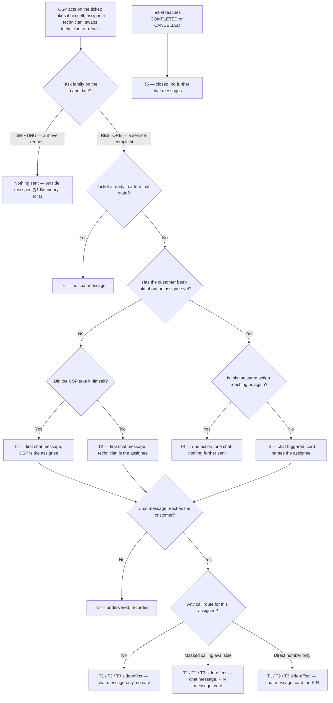

# Service Ticket Chat — telling the customer who is working

| | | | |
|---|---|---|---|
| **Owner** — Ashish Raj (PM) | **Reviewer** — TBD ⚠️ *AI GENERATED — review* | **Status** — Draft | **Sign-off** — Pending |
| **Version** — v0.1 · 11 Sep 2026 | **Consulted — CSP execution (TAS)** — TBD ⚠️ *AI GENERATED — review* | **Consulted — Customer chat** — TBD ⚠️ *AI GENERATED — review* | **Consulted — IVR / masked calling** — TBD ⚠️ *AI GENERATED — review* |

---

## 1. Objective & Definition of Success

**Objective.** A customer with an open service ticket can tell, without calling anyone, that a named person is now working on their problem — and can reach that person in one tap.

**Boundary.** This spec governs the chat message sent to a customer when the **assignee** of their service ticket is set or changes. It covers restore service tickets on every creation path — IVR, customer chat and Kapture-direct alike — and it is the customer's only new surface: the chat thread.

It leaves unchanged: how a ticket is created, classified, deadlined, verified or closed; the CSP app and the actions in it; the existing CSP-side and technician-side notifications that already fire on the same events; the complaint chat intake gates and the resolution message the customer already receives. The masked-calling PIN workflow is reused unchanged: this spec decides when it fires, never what it says (§4 bubble 2).

**Shifting is out of scope, and must be filtered out.** The `ES_RESTORE_TECHNICIAN_ASSIGNED` event does not distinguish task family, so without an explicit check a shifting customer would receive this feature by default — and the chat message copy is complaint-framed ("आपकी शिकायत" / "Your complaint… resolving your issue"), which is wrong for a request to move a connection. Shifting already has its own customer workflows (`ticket_type_5_created`, `ticket_type_5_tat_breached`, `ticket_type_5_resolved`) and is already barred from the PIN and card path, which accepts only `NBREC`, `INSTALL` and `RESTORE`. Excluding it here is therefore consistent with how the estate already treats it. R7 makes the exclusion a requirement rather than an omission. **This leaves a known, deliberate gap**: 94% of shifting candidates are assigned a technician, a median 4.4 hours after creation, against a 96-hour TAT, and that customer is told nothing — the same problem this PRD solves for restore. It is V2 work, not a non-problem. Customers whose app is too old to receive a chat see nothing new, and this spec does not add another channel to reach them (M1's ceiling, not a defect).

### Guardrails — promises that hold on every path

| ID | Guardrail | One line | Anchors |
|---|---|---|---|
| G1 | **Current person only** | The newest card in the thread names the person assigned at the moment its action happened, so the name a customer is holding is never a superseded one. | R2a · R3a · AC-CHG-1 · AC-RACE-2 · MQ-2 |
| G2 | **Every card works** | A contact card appears only when a masked route or a live direct number actually resolved; otherwise the chat goes out without one. | R3a · R3b · R3c · R3d · AC-CARD-4 · MQ-3 |
| G3 | **Live contact source only** | Names and numbers come from the live contact record (§8) — never from an older copy of those details held elsewhere. | R3 MUST NOT (c) · AC-GRD-1 · MQ-3 |
| G4 | **One action, one chat** | Every assign action triggers exactly one chat — never two for a single action, and never none because the assignee is unchanged. | R4a · R4b · AC-DUP-1 · AC-SUP-2 · MQ-1 |
| G5 | **Silence after closure** | No chat is triggered by an action that happens after the ticket reaches a terminal state. | R6a · AC-CLS-2 · MQ-1 |
| G6 | **The card reaches the person it names** | The call action connects the customer to the assignee named on that card — never to someone else standing in for them. | R3a · R3c · R3 MUST NOT (b) · AC-CARD-2 · AC-GRD-3 · MQ-3 |

### Success metrics

| ID | Metric | Baseline | Target | Source |
|---|---|---|---|---|
| M1 | Service tickets where the customer received at least one chat message before the resolution message | 0% — new capability | ≥ 90% of tickets that reach an assignee ⚠️ *AI GENERATED — review* | MQ-1 |
| M2 | Repeat customer contacts per ticket after the first chat message | **unmeasured** — repeat contacts are not captured against any ticket today; MQ-5 must build this before M2 can be read | −20% against the baseline MQ-5 establishes ⚠️ *AI GENERATED — review* | MQ-5 |
| M3 | Cards whose call action the customer used | n/a — new capability | Observed, not targeted | MQ-3 |

**Invariant (not a metric):** G3 cards carrying a name or number from anything but the live contact record = 0, zero tolerance. Monitored via MQ-3, not trended.

---

## 2. User Stories & Rules

| ID | Story | MUST | MUST NOT |
|---|---|---|---|
| R1 | As a customer with an open service ticket, I want to know when someone actually starts working on it, so that I stop calling to find out. | **(a)** Send a chat message the first time a person takes the ticket — the CSP taking it himself, or a technician he assigns. **(b)** Do this for every service ticket, whatever channel the ticket was created on. **(c)** Send it in the customer's own language, one variant only. | Send a chat message before any person has taken the ticket. A ticket merely sitting with the CSP is not an assignee. |
| R2 | As a customer, I want to know when the person working on my ticket changes, so that the name I am holding is the person actually coming. | **(a)** Send a chat message on every genuine change of assignee — one technician swapped for another, or the CSP taking the job back off a technician. **(b)** Use one message for every change, whether the new assignee is a technician or the CSP himself. | Leave the customer holding a name that has been superseded (G1). |
| R3 | As a customer, I want to reach the person working on my ticket in one tap, without hunting for a number. | **(a)** Alongside every chat message, send a contact card naming the assignee, carrying a call action. **(b)** Where masked calling is available for the ticket, precede the card with the PIN message and route the call through the masked number. **(c)** Where it is not, the card calls the **assignee's own** direct number, read from the live contact record. **(d)** Where no route resolves at all, send the chat message with no card. | **(a)** Show a card with no working route behind it (G2). **(b)** Name one person on the card and connect the customer to another (G6). **(c)** Read the name or number from any source other than the live contact record (G3). |
| R4 | As a customer, I want one message for each thing that actually happened — not two for one, and not silence when something did happen. | **(a)** Trigger the chat for every assign action the CSP takes, including assigning the same person again. **(b)** Send one chat per action: an action that reaches the system more than once — a double tap, a retry, a redelivered event — still produces one chat. | Send two chats for one action, or stay silent on a real one because the person happens to be unchanged. |
| R5 | As a customer, I want to hear that work has started, and to be able to call, even when Wiom cannot tell me the person's name. | **(a)** Send the chat message unchanged — it never carries a name — and send the card with its call action intact but no name shown. | Put a different person's name on the card in place of the assignee's. |
| R6 | As Wiom, I want chat messages to stop when the ticket is done, so that a closed ticket never looks live. | **(a)** Generate no chat message from an action that happens after the ticket reaches a terminal state. | Suppress a chat message generated before closure merely because it will land after the resolution message. |
| R7 | As a customer with a shifting request, I want not to be told my "complaint" is being resolved, because I did not report a fault. | **(a)** Send nothing for any candidate whose task family is not `RESTORE` — no chat, no PIN message, no card. Today that means `SHIFTING`, which the same service handles on the same records and which only this field tells apart. | Rely on the absence of a rule to keep shifting out. The check is explicit, because the triggering event does not carry the distinction. |

---

## 3. System Behaviour

### 3a. System flow chart

**Precedence:**

- **P1 — Closure wins a tie.** An assign action and the ticket's closure landing at the same instant resolve closure first; the assign action is then dispatched fresh and falls to T6, generating no chat message (AC-RACE-1). ⚠️ *AI GENERATED — review*
- **P2 — Order of action, not order of arrival.** A chat message generated by an action that happened before closure is delivered even if it lands in the chat after the resolution message. Chat messages are never dropped for arriving late (AC-RACE-2).

### 3b. State transition table — canon

Lifecycle of **who the customer has been told about** — one per ticket, created the first time we tell them who is working on it. The ticket's own lifecycle — creation, classification, deadline, verification, closure — and the CSP's execution states are out of scope; they appear here only as triggers.

**Precondition for every row below:** the candidate's task family is `RESTORE`. Shifting candidates are handled by the same service, on the same records, and are separated only by that field — a `SHIFTING` candidate never enters this lifecycle at all (R7a, §3a).

| ID | From | Action / Trigger | Rule / Check | To | Side-effects |
|---|---|---|---|---|---|
| T1 | — | CSP takes the ticket himself | Ticket not in a terminal state | Told — CSP | Chat triggered (R1a); contact card sent naming the CSP, preceded by the PIN message inside the cohort (R3a, R3b) or on its own outside it (R3c); CSP recorded as the one we told them about (R4a). |
| T2 | — | CSP assigns a technician, no chat sent yet | Ticket not in a terminal state | Told — technician | Chat triggered (R1a); contact card sent naming the technician, per R3a–R3d; technician recorded as the one we told them about (R4a). |
| T3 | Told — person X | Any further assign action: a different technician, the CSP recalling the job off X, **or X assigned again** | Ticket not in a terminal state | Told — the assignee just named | Chat triggered again, same copy (R2a, R2b); **a fresh contact card sent naming the new assignee**, route re-resolved for them (R3a–R3d, G6), so the newest card in the thread is always the current person (G1); new assignee recorded (R4a). |
| T4 | Told — person X | One assign action reaching the system a second time — a double tap, a client retry, a redelivered event | The action has already been processed | Told — X (unchanged) | **No second chat** (R4b, G4) — the first one already went. Recorded as a duplicate so MQ-1 can tell it from a failure. Telling one action's duplicate from two real actions is the implementer's; the promise is one chat per action. |
| T5 | Told — X, or — | Ticket reaches COMPLETED or CANCELLED | — | Closed | No side-effect of its own. Chats already triggered still deliver (P2, R6 MUST NOT). |
| T6 | Closed | Any later assign, swap or recall action | — | Closed | **No chat triggered** (R6a, G5). |
| T7 | Any transition that would trigger a chat | The chat cannot be delivered — the customer's app is too old to receive it, there is no chat identity, or the send fails | — | Unchanged | **Envelope:** the customer receives nothing and is told nothing later; no recovery is promised (Override O1). The miss is recorded against the ticket and counts as a failure for M1 (MQ-1). Who we told them about is **not** updated, so the next genuine change still triggers a chat (R4a). |

**What T1, T2 and T3 send.** Each triggers the chat, then the contact card — with the PIN message between them inside the masked-calling cohort, so two bubbles outside it and three within. This mirrors the existing create-ticket flow, which sends its text and then requests the masked-call connection separately. The copy is fixed and identical on all three; it never names anyone. The assignee's name is carried on the card.

**Degradation inside T1, T2 and T3** — variants of the same emission, not separate states:

| Condition | Customer receives |
|---|---|
| Masked calling available for the ticket (R3b) | Chat message · PIN message · card naming the assignee, calling through the masked number |
| Masked calling unavailable (R3c) | Chat message · card naming the assignee, calling their own direct number — no PIN message |
| Assignee's name unresolved (R5a) | Chat message · card with the call action but no name shown |
| No route resolves at all (R3d) | Chat message only, no card (G2) |

---

## 4. Screen Requirements

**Experience intent:** the customer should feel accompanied — a real person, named, now has this, and reaching them is one tap away.

**Master design file:** ⚠️ *AI GENERATED — review* **Not yet created.** No design file exists. The copy below is the message already in production; the card's visual treatment is the existing contact card used by the create-ticket flow.

Each time the assignee is set or changes, the customer receives **two or three bubbles**, in this order:

| # | Bubble | When |
|---|---|---|
| 1 | Chat message | Always (R1a) |
| 2 | PIN message | Only inside the masked-calling cohort (R3b) |
| 3 | Contact card — assignee's name + call action | Whenever a route resolved (R3a, R3d) |

### Bubble 1 — chat message

**States:** sent (an assignee was set or changed — T1, T2, T3) · not sent (no assignee yet, ticket terminal, or an app too old to receive it — T6, T7)
**Freshness:** appended when generated. No delivery window is committed — see Override O1. Latency is measured, not promised (MQ-4).

Copy in production, one language per customer, not both:

> **Hindi** — आपकी शिकायत (टिकट ID: `<ticket_id>`) के लिए **एक ख़ास इंजीनियर असाइन हो गया है** और वो आपकी समस्या पे जोर शोर से काम कर रहे है।
>
> **English** — Your complaint (Ticket ID: `<ticket_id>`) has been **assigned to a dedicated engineer**, and they are working hard on resolving your issue.

| Element | Source / Routes to | Logic |
|---|---|---|
| Field — ticket id | the service ticket the chat message belongs to | Always shown, so a customer with more than one open ticket can tell them apart. |
| Field — body copy | fixed copy above | Identical on T1, T2 and T3 — first chat message, technician swap and recall read the same (R2b). **Names no one**: the assignee is carried on bubble 3, not here. |
| Check — language | customer's language preference | One variant is sent, never both (R1c). |

### Bubble 2 — PIN message (cohort only)

**This spec does not define this message.** It is the live masked-calling workflow, already in
production and already sent by the create-ticket flow. This feature triggers it, unchanged, on
every chat message where masked calling is available. Its copy, its PIN and its behaviour are
owned by that workflow, not here (§1 Boundary).

**States:** sent (masked calling available for this ticket — R3b) · not sent (unavailable — R3c)
**Freshness:** sent with bubble 3, immediately after bubble 1.

Illustrative only — what that workflow sends today, quoted so the reader knows what the customer
sees between bubbles 1 and 3:

> इंजीनियर से कनेक्ट करने के लिए कॉल के वक़्त PIN पूछा जा सकता है। आपका PIN: `<pin>`

| Element | Source / Routes to | Logic |
|---|---|---|
| Trigger — masked-call workflow | the existing live workflow, invoked per ticket | Invoked on every chat message where masked calling resolved (R3b), including a swap (T3). This spec owns *when* it fires; the workflow owns what it says. |

### Bubble 3 — contact card

**States:** named with call action (name and route both resolved) · unnamed with call action (name unresolved, route resolved — R5a) · absent (no route resolved — R3d)
**Freshness:** sent immediately after bubble 1, or after bubble 2 where that is sent. A swap (T3) sends a **fresh card**; the newest card in the thread always names the current assignee (G1).

| Element | Source / Routes to | Logic |
|---|---|---|
| Field — assignee name | live contact record for the assignee (§3b, §8) | The CSP's name when the CSP took it himself, the technician's when one is assigned. Omitted — never substituted — when it cannot be resolved (R5a). |
| Action — call | masked number where available (R3b), else the assignee's own direct number (R3c) | Offered only when a route resolved (R3d, G2). Connects to the person named on this card and no one else (G6). |
| Check — route resolution | — | If no route resolves, the card is not sent at all; bubble 1 still goes (R3d). |
| Check — contact source | — | Name and number came from the live contact record; a value from any older copy is never rendered (G3). |

---

## 5. Configurability

**This feature introduces no configurable parameters.**

Three numbers touch it, and none of them is ours to set:

| The number | Who owns it |
|---|---|
| The minimum app version that can receive a chat at all | The chat platform's own rollout gate. Below it the customer gets nothing (T7) — a ceiling on M1, not a setting of ours. |
| The PIN, and the ticket type used to request it | The masked-calling workflow, reused unchanged (§1 Boundary, §4 bubble 2). |
| Delivery speed | Not committed at all. Best effort, measured through MQ-4 and never promised — see Override O1. |

There is no cap on how many chats one ticket may send. A chat follows every genuine change of assignee by decision, and duplicates are suppressed by person rather than by count (R4b, G4).

---

## 6. Measurement

| ID | The system must be able to answer… | Feeds |
|---|---|---|
| MQ-1 | For each service ticket: how many chats were triggered, who each card named, and for each one whether it was delivered, suppressed as a duplicate, or failed to deliver. | M1 · G4 · G5 |
| MQ-2 | For each card: whether the person it named was the assignee at the moment the action occurred. | G1 |
| MQ-3 | For each card: whether it was sent, whom it named, which route it carried (masked, direct, or none), which record the name and number came from, and whether the call reached the person named. | G2 · G3 invariant · G6 · M3 |
| MQ-4 | For each delivered chat message: the time between the CSP's action and the chat appearing in the thread. | Override O1 — measured, never committed |
| MQ-5 | For each ticket: how many times the customer contacted us about it, split before and after the first chat message — and the same figure for tickets that received no chat message. | M2, including its missing baseline |

---

## 7. Acceptance Criteria

Worked data used throughout: customer **Sunita Devi**, account `WN4471203`, ticket **1787745414303000** raised 11 Sep 2026 09:14 IST; CSP **Ramesh Kumar**; technicians **Imran Sheikh** and **Vikas Yadav**; masked DID `08047106321`, PIN `015564`.

### FST — First chat message (T1, T2)

| AC | Given / When / Then | Verifies | Status |
|---|---|---|---|
| AC-FST-1 | **Given** ticket 1787745414303000 open with no chat sent yet, **and** masked calling available for it, **When** Ramesh Kumar takes the ticket himself at 09:31, **Then** Sunita receives three bubbles in order — the chat quoting ticket 1787745414303000 and **naming no one**, the PIN message, and a card naming Ramesh Kumar — and Ramesh is recorded as last told. | R1a · R3b · T1 | Settled |
| AC-FST-2 | **Given** ticket 1787745414303000 open with no chat sent yet, **and** masked calling **not** available for it, **When** Ramesh assigns Imran Sheikh at 09:31 without taking it himself first, **Then** Sunita receives two bubbles — the same chat, naming no one, and a card naming Imran Sheikh — **no PIN message is sent**, and Imran is recorded as last told. | R1a · R3c · T2 | Settled |
| AC-FST-3 | **Given** ticket 1787745414303000 was created by a call-centre agent in Kapture and Sunita has never used chat, **When** Ramesh assigns Imran, **Then** the chat and its card still reach her thread — creation channel makes no difference to either. | R1b · T2 | Settled |
| AC-FST-4 | **Given** ticket 1787745414303000 open and untouched since 09:14, **When** two hours pass with no CSP action, **Then** no chat, no PIN message and no card have been sent at any point. | R1 MUST NOT · T1 · T2 | Settled |

The same chat copy is sent on T1 and T2 — see AC-CHG-2 for T3. Which bubbles follow it is decided only by the call route (R3b, R3c), never by whether the assignee is the CSP or a technician.

### CHG — Change of assignee (T3)

| AC | Given / When / Then | Verifies | Status |
|---|---|---|---|
| AC-CHG-1 | **Given** Sunita has been told her ticket is with a dedicated engineer and holds a card naming Imran Sheikh, **When** Ramesh swaps the assignment to Vikas Yadav at 11:02, **Then** a further chat message is sent and **a fresh card naming Vikas Yadav** appears below it, so the newest card in the thread names Vikas and not Imran, and Vikas is the person last told. | R2a · R2 MUST NOT · R3a · T3 · G1 | Settled |
| AC-CHG-2 | **Given** Sunita has been told Imran Sheikh is handling the ticket, **When** Ramesh recalls the job off Imran at 11:02 and it returns to him, **Then** the chat is triggered again with the same copy and a fresh card naming Ramesh Kumar appears below it — a recall reads to the customer exactly like any other change. | R2a · R2b · T3 | Settled |
| AC-CHG-3 | **Given** Sunita has been told Vikas Yadav is handling the ticket, **When** Ramesh swaps back to Imran Sheikh at 12:40, **Then** the chat is triggered again and a fresh card naming Imran appears — a swap back is an action like any other. | R2a · T3 · G4 boundary | Settled |
| AC-CHG-4 | **Given** the swap in AC-CHG-1 and masked calling available for the ticket, **When** the chat message for Vikas is sent, **Then** the PIN message is sent again alongside the fresh card — the customer is never left with a current card and no way to read the PIN. | R3b · T3 | Settled |

### SUP — Suppression (T4)

| AC | Given / When / Then | Verifies | Status |
|---|---|---|---|
| AC-SUP-1 | **Given** Ramesh assigns Imran at 09:31:00 and the chat goes out, **When** that same action reaches the system again at 09:31:04 — a double tap on the button — **Then** no second chat appears in her thread, and it is recorded as a duplicate rather than a delivery failure. | R4b · T4 · G4 | Settled |
| AC-SUP-2 | **Given** Sunita already holds a card naming Imran Sheikh from 09:31, **When** Ramesh assigns Imran again at 11:40 as a fresh action, **Then** the chat is triggered again and a fresh card naming Imran appears — an unchanged assignee is not a reason for silence. | R4a · R4 MUST NOT · T3 · G4 | Settled |

### CLS — Closure (T5, T6)

| AC | Given / When / Then | Verifies | Status |
|---|---|---|---|
| AC-CLS-1 | **Given** Sunita has been told Imran Sheikh is handling the ticket, **When** the ticket is marked resolved at 12:15 and closes, **Then** her thread holds the chat and card naming Imran, followed by the resolution message, and no further chat is triggered for that ticket. | T5 · R6a | Settled |
| AC-CLS-2 | **Given** ticket 1787745414303000 closed at 12:15, **When** an assign-Vikas action arrives at 12:18 against the closed ticket, **Then** no chat message is sent and Sunita's thread is unchanged. | R6a · T6 · G5 | Settled |

### CARD — Contact card and call route (R3, R5)

| AC | Given / When / Then | Verifies | Status |
|---|---|---|---|
| AC-CARD-1 | **Given** masked calling is available for ticket 1787745414303000, **When** Imran Sheikh is assigned, **Then** Sunita receives three bubbles in order — the chat message quoting ticket 1787745414303000, the PIN message showing PIN `015564`, and a card naming Imran Sheikh with a call action — and no personal mobile number appears in any of them. | R3a · R3b · T2 | Settled |
| AC-CARD-2 | **Given** masked calling is not available for ticket 1787745414303000 and Imran Sheikh's live contact record holds `9812345670`, **When** Imran is assigned, **Then** Sunita receives the chat message and a card naming Imran whose call action dials `9812345670` — Imran's own number, not Ramesh Kumar's — and no PIN message is sent. | R3c · G6 · T2 | Settled |
| AC-CARD-3 | **Given** masked calling is not available and Ramesh Kumar takes ticket 1787745414303000 himself, **When** the chat message is sent, **Then** the card names Ramesh Kumar and dials Ramesh Kumar's own number — the assignee is the CSP in this case, and the card is truthful either way. | R3c · R3a · G6 · T1 | Settled |
| AC-CARD-4 | **Given** neither masked calling nor any direct number resolves for Imran Sheikh, **When** he is assigned, **Then** the chat message is still sent and **no card is sent at all** — the customer is never shown a call action that cannot connect. | R3d · R3 MUST NOT (a) · G2 · T2 | Settled |
| AC-CARD-5 | **Given** Imran Sheikh's name cannot be resolved but his number can, **When** he is assigned, **Then** the chat message is sent unchanged and the card is sent with a working call action and no name — Ramesh Kumar's name does not appear on it. | R5a · R5 MUST NOT · T2 | Settled |
| AC-CARD-6 | **Given** Sunita's language preference is Hindi, **When** Imran is assigned, **Then** she receives the Hindi copy only, and the English variant is not also sent. | R1c · §4 bubble 1 | Settled |

### WF — Workflows

| AC | Given / When / Then | Verifies | Status |
|---|---|---|---|
| AC-WF-1 | **Given** ticket 1787745414303000 raised at 09:14, **When** Ramesh takes it at 09:31, assigns Imran at 09:48, swaps to Vikas at 11:02, and the ticket resolves at 12:15, **Then** Sunita's thread holds exactly three chats, each with its own card — naming Ramesh, then Imran, then Vikas — followed by the resolution message, and the newest card names Vikas. | T1 · T3 · T5 · G1 · G4 | Settled |
| AC-WF-2 | **Given** ticket 1787745414303000 raised at 09:14, **When** Ramesh takes it at 09:31 and marks it resolved at 09:33, **Then** Sunita receives the chat and the card naming Ramesh, then the resolution message roughly two minutes later, and neither is suppressed on account of the other. | T1 · T5 · P2 | Settled |

### FAIL — Failure envelope (T7)

| AC | Given / When / Then | Verifies | Status |
|---|---|---|---|
| AC-FAIL-1 | **Given** Sunita's app is too old to receive a chat, **When** Imran is assigned, **Then** she receives nothing, nothing is queued for a later upgrade, the ticket is recorded as having a failed chat, and it counts against M1. | T7 | Settled |
| AC-FAIL-2 | **Given** the chat and card for Imran failed to deliver, **When** Ramesh takes any further assign action — Vikas, or Imran again — **Then** a fresh chat and card are attempted: a failed send never becomes a reason to stay silent. | T7 · R4a | Settled |

### REG — Regression (§1 Boundary)

| AC | Given / When / Then | Verifies | Status |
|---|---|---|---|
| AC-REG-1 | **Given** Imran Sheikh is assigned to ticket 1787745414303000, **When** the assignment happens, **Then** the notifications Ramesh Kumar and Imran already receive today on the CSP and technician apps fire exactly as before, unchanged in content and timing. | §1 Boundary | Settled |
| AC-REG-2 | **Given** Sunita opens chat and reports a new internet problem while ticket 1787745414303000 is already open, **When** the complaint flow runs, **Then** she gets the existing open-ticket response and engineer callback exactly as today — chat messages change nothing about intake. | §1 Boundary | Settled |
| AC-REG-3 | **Given** a shifting candidate on ticket 1789100000000000, **When** a technician is assigned to it, **Then** no chat message, no PIN message and no card are sent — and the customer's existing `ticket_type_5_*` workflows fire exactly as they do today. | R7a · §1 Boundary | Settled |
| AC-REG-4 | **Given** the same shifting candidate, **When** the `ES_RESTORE_TECHNICIAN_ASSIGNED` event for it reaches this feature, **Then** it is discarded once the candidate's task family is read as `SHIFTING` — the event arriving is not by itself sufficient to send anything. | R7a · R7 MUST NOT | Settled |

### RACE — Precedence (P1, P2)

| AC | Given / When / Then | Verifies | Status |
|---|---|---|---|
| AC-RACE-1 | **Given** ticket 1787745414303000 where Imran is the person last told, **When** a swap to Vikas and the ticket's closure land at the same instant, **Then** closure resolves first, the swap generates no chat message, and the last name Sunita holds is Imran. | P1 · T6 · G5 | Settled |
| AC-RACE-2 | **Given** the swap to Vikas occurred at 11:02:00 and the ticket closed at 11:02:01, **When** the Vikas chat message reaches the thread at 11:02:09 — after the resolution message — **Then** it is still delivered and not dropped, and Sunita's assignee history remains truthful. | P2 · R6 MUST NOT · G1 | Settled |

### DUP — Duplicate trigger

| AC | Given / When / Then | Verifies | Status |
|---|---|---|---|
| AC-DUP-1 | **Given** Ramesh taps assign-Imran once, **When** that single action reaches the system five times in ten seconds, **Then** exactly one chat and one card naming Imran exist in Sunita's thread. | R4b · T4 · G4 | Settled |

### GRD — Guardrails

| AC | Given / When / Then | Verifies | Status |
|---|---|---|---|
| AC-GRD-1 | **Given** an older copy of the CSP contact details elsewhere in the estate still shows `Suresh Yadav / 9811111111` for Sunita's connection, while the live contact record for the assignee holds `Imran Sheikh / 9812345670`, **When** a card with a direct-number call action is sent, **Then** it names Imran Sheikh and dials `9812345670` — never `Suresh Yadav` or `9811111111` — and the source recorded against the card is the live contact record. | G3 · R3 MUST NOT (c) · MQ-3 | Settled |
| AC-GRD-2 | **Given** every card delivered over a full day of production traffic, **When** MQ-2 is run against it, **Then** each card named the person assigned at the moment of its triggering action — no card named a person already superseded. | G1 · MQ-2 | Settled |
| AC-GRD-3 | **Given** every card delivered over a full day of production traffic, **When** MQ-3 is run against it, **Then** each card's call action reached the person named on that card — no card connected the customer to a stand-in. | G6 · R3 MUST NOT (b) · MQ-3 | Settled |

---

## 8. Glossary

| Term | Meaning | Owner (domain) |
|---|---|---|
| Assignee | **Canonical definition:** the single person currently responsible for doing the work on a service ticket — either the CSP who took it himself, or the technician he assigned. All other mentions cite this definition. | CSP execution |
| Last told | **Canonical definition:** the assignee the customer was most recently told about. It can lag the real assignee between an action and the chat that follows it. This is the entity whose lifecycle §3b describes, and it carries the person, whether they are the CSP or a technician, and the ticket. It records what the customer knows; it is **not** a reason to withhold a chat (R4a). | — |
| Chat message | **Canonical definition:** the fixed-copy message triggered when the assignee is set or changes (§4 bubble 1). The same on a first send, a swap and a recall; it names no one. | — |
| Contact card | **Canonical definition:** the chat bubble carrying the assignee's name and a call action (§4 bubble 3), sent alongside every chat where a route resolves. The only place a person is named. | — |
| Live contact record | **Canonical definition:** the record where a person's own name and mobile number are maintained and kept current — the CSP's and the technician's alike, in one place. Any other copy of those details held elsewhere in the estate is stale by definition and is never read on this path (G3). | CSP identity |
| Masked calling | A call route where the customer dials a shared number and enters a PIN to be connected to the assignee, so neither party sees the other's number. Availability is decided per ticket by the IVR service, not by this spec. | IVR / masked calling |
| Terminal state | A ticket state from which no further work happens — resolved-and-closed, or cancelled. Used by R6a and G5 as the point chats stop. | CSP execution |

---

## 9. Notes for System Capabilities

What the platform must be able to do for this feature to exist. Whether these are one system or several, and how they interact, is the implementer's design.

| Capability | Needed by |
|---|---|
| Observe every change of assignee on a service ticket — the CSP taking it himself, a technician assigned, a technician swapped, a job recalled — and carry enough identity with each to reach that ticket's customer. Today only the technician-assignment signal carries customer identity; the self-assign and recall signals carry none. | T1 · T2 · T3 · R1a · R2a |
| Recognise one assign action reaching the system more than once, so a double tap or a retry sends a single chat — without mistaking two real actions for one. | T4 · R4b · G4 |
| Resolve the assignee's display name **and their own direct number** from their identifier at send time — the same lookup for a CSP and for a technician — and proceed without a name when it cannot be resolved. | R3c · R5a · G6 · T1 · T2 · T3 |
| Read those details only from the live contact record, and record which source each card used. | G3 · AC-GRD-1 · MQ-3 |
| Trigger the existing masked-calling workflow for a ticket, and tell whether masked calling is available for it. The workflow itself is reused, not rebuilt. | R3b |
| Push an unprompted message into a customer's chat thread, keyed to their account, for any customer whose app can receive one, whatever channel their ticket came from — in the customer's own language. | R1b · T1 · T2 · T3 |
| Send a contact card carrying a name and a call action, and re-send a fresh one whenever the assignee changes. | R3a · G1 · G6 · T3 |
| Read the candidate's task family at the point the assignment event is handled, and act only on `RESTORE`. The event does not carry the field, and the two families share a service and a record shape, so nothing else distinguishes them. | R7a · AC-REG-3 · AC-REG-4 |
| Record, per chat message, whether it was delivered, suppressed as a duplicate, or failed — and which call route and contact source it carried. | MQ-1 · MQ-2 · MQ-3 · MQ-4 |
| Count customer contacts against a ticket, before and after the first chat message. This does not exist today — nothing captures it for any ticket. | MQ-5 · M2 |

---

## AI-generated content for review

| Location | What was generated | Basis |
|---|---|---|
| Header — Reviewer | "TBD" | No engineering reviewer named in the interview. Blocks sign-off (L15). |
| Header — Consulted (3 cells) | CSP execution (TAS), Customer chat, IVR / masked calling | Inferred from the three systems this feature touches. You named no consulted parties. |
| §1 M1 — target | ≥ 90% of tickets that reach an assignee | Derived from measurement: 95% of restore candidates reach an assignee state, so 95% is the structural ceiling; 90% leaves room for the T7 envelope. You set no target. |
| §1 M2 — target | −20% against the MQ-5 baseline | No baseline exists, so any target is a guess. Needs your number once MQ-5 reports. |
| §3a P1 — precedence | Closure resolves before a simultaneous assign action | You decided "send everything, no suppression" for the ordinary case, but did not rule on the closure tie. Chosen to keep G5 absolute. |
| §4 — Master design file | "No design file exists" | The chat message and PIN copy are production copy you supplied; the card is the existing create-ticket contact card. What is missing is a design file, not a design. |

---

## Overrides

| Rule overridden | What was done instead | Rationale | Approved by |
|---|---|---|---|
| L8 / J2 — every customer-facing moment sits inside a C-id window with a specified customer-visible state | No delivery window is committed, and no configurable parameter defines one. The chat is best-effort; latency is measured through MQ-4 but never promised, and T7 promises the customer no recovery. | PM decision in interview: a progress message does not warrant the retry and recovery engineering a committed window would force. Measuring it keeps the decision reversible — if MQ-4 shows chats arriving after resolution often enough to matter, a committed window can be added without reopening the rest of the spec. | Ashish Raj, 11 Sep 2026 |
