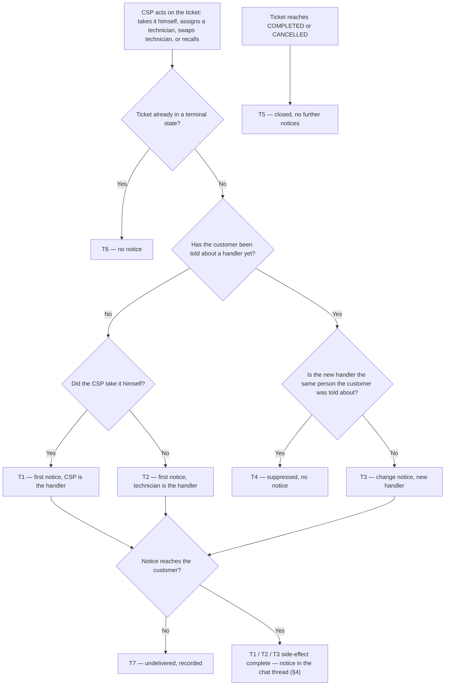

# Service Ticket Handler Notice — telling the customer who is working

| | | | |
|---|---|---|---|
| **Owner** — Ashish Raj (PM) | **Reviewer** — TBD ⚠️ *AI GENERATED — review* | **Status** — Draft | **Sign-off** — Pending |
| **Version** — v0.1 · 11 Sep 2026 | **Consulted — CSP execution (TAS)** — TBD ⚠️ *AI GENERATED — review* | **Consulted — Customer chat** — TBD ⚠️ *AI GENERATED — review* | **Consulted — IVR / masked calling** — TBD ⚠️ *AI GENERATED — review* |

---

## 1. Objective & Definition of Success

**Objective.** A customer with an open service ticket can tell, without calling anyone, that a named person is now working on their problem — and can reach that person in one tap.

**Boundary.** This spec governs the chat notice sent to a customer when the **handler** of their service ticket is set or changes. It covers restore service tickets on every creation path — IVR, customer chat and Kapture-direct alike — and it is the customer's only new surface: the chat thread.

It leaves unchanged: how a ticket is created, classified, deadlined, verified or closed; the CSP app and the actions in it; the existing CSP-side and technician-side notifications that already fire on the same events; the complaint chat intake gates and the resolution message the customer already receives. The shifting task family is out of scope. Notices reach customers on app version C-01 and above; below that the customer sees nothing new, and this spec does not add another channel to reach them (M1's ceiling, not a defect).

### Guardrails — promises that hold on every path

| ID | Guardrail | One line | Anchors |
|---|---|---|---|
| G1 | **Current person only** | Every notice names the handler assigned at the moment the action happened, so the latest notice a customer holds is never a superseded person. | R2a · AC-CHG-1 · AC-RACE-2 · MQ-2 |
| G2 | **Every CTA works** | A call CTA appears only when a masked route or a live direct number actually resolved; otherwise the notice ships without one. | R3a · R3b · R3c · AC-CTA-3 · MQ-3 |
| G3 | **Live contact source only** | Contact details come from the live gateway CSP record. `t_account_mapping1` is never read on this path. | R3 MUST NOT (b) · AC-GRD-1 · MQ-3 |
| G4 | **One notice per real change** | An assign action naming the person the customer was already told about sends nothing. | R4a · R4b · AC-DUP-1 · MQ-1 |
| G5 | **Silence after closure** | No notice is generated by an action that happens after the ticket reaches a terminal state. | R6a · AC-CLS-2 · MQ-1 |

### Success metrics

| ID | Metric | Baseline | Target | Source |
|---|---|---|---|---|
| M1 | Service tickets where the customer received at least one handler notice before the resolution message | 0% — new capability | ≥ 90% of tickets that reach a handler ⚠️ *AI GENERATED — review* | MQ-1 |
| M2 | Repeat customer contacts per ticket after the first notice | **unmeasured** — `NO_TIMES_CUSTOMER_CALLED` on `SERVICE_TICKET_MODEL` is null for every row; MQ-5 must build this before M2 can be read | −20% against the baseline MQ-5 establishes ⚠️ *AI GENERATED — review* | MQ-5 |
| M3 | Notices whose call CTA the customer used | n/a — new capability | Observed, not targeted | MQ-3 |

**Invariant (not a metric):** G3 notices carrying contact details sourced from `t_account_mapping1` = 0, zero tolerance. Monitored via MQ-3, not trended.

---

## 2. User Stories & Rules

| ID | Story | MUST | MUST NOT |
|---|---|---|---|
| R1 | As a customer with an open service ticket, I want to know when someone actually starts working on it, so that I stop calling to find out. | **(a)** Send a chat notice the first time a person takes the ticket — the CSP taking it himself, or a technician he assigns. **(b)** Do this for every service ticket, whatever channel the ticket was created on. | Send a notice before any person has taken the ticket. A ticket merely sitting with the CSP is not a handler. |
| R2 | As a customer, I want to know when the person working on my ticket changes, so that the name I am holding is the person actually coming. | **(a)** Send a notice on every genuine change of handler — one technician swapped for another, or the CSP taking the job back off a technician. **(b)** Use one message for every change, whether the new handler is a technician or the CSP himself. | Leave the customer holding a name that has been superseded (G1). |
| R3 | As a customer, I want to reach the person working on my ticket in one tap, without hunting for a number. | **(a)** Where masked calling is available for the ticket, the CTA connects through the masked route and the notice carries the PIN. **(b)** Where it is not, the CTA calls the CSP's direct number, read from the live gateway CSP record. **(c)** Where neither resolves, send the notice with no CTA at all. | **(a)** Show a CTA with no working route behind it (G2). **(b)** Read the name or number from `t_account_mapping1` (G3). |
| R4 | As Wiom, I want one notice per real change, so that the chat stays readable and the customer trusts each message. | **(a)** Remember which person the customer was last told about, per ticket. **(b)** Send nothing when an assign action names that same person. | Send two notices naming the same person in a row, however many times the action fires. |
| R5 | As a customer, I want to hear that work has started even when Wiom cannot tell me the person's name. | **(a)** Send the notice without a name when the handler's name cannot be resolved, keeping the CTA. | Put a different person's name in place of the handler's. |
| R6 | As Wiom, I want notices to stop when the ticket is done, so that a closed ticket never looks live. | **(a)** Generate no handler notice from an action that happens after the ticket reaches a terminal state. | Suppress a notice generated before closure merely because it will land after the resolution message. |

---

## 3. System Behaviour

### 3a. System flow chart

**Precedence:**

- **P1 — Closure wins a tie.** An assign action and the ticket's closure landing at the same instant resolve closure first; the assign action is then dispatched fresh and falls to T6, generating no notice (AC-RACE-1). ⚠️ *AI GENERATED — review*
- **P2 — Order of action, not order of arrival.** A notice generated by an action that happened before closure is delivered even if it lands in the chat after the resolution message. Notices are never dropped for arriving late (AC-RACE-2).

### 3b. State transition table — canon

Lifecycle of a **notified handler** (created the first time the customer is told who is working on their service ticket; one per ticket). The ticket's own lifecycle — creation, classification, deadline, verification, closure — and the CSP's execution states are out of scope; they appear here only as triggers.

| ID | From | Action / Trigger | Rule / Check | To | Side-effects |
|---|---|---|---|---|---|
| T1 | — | CSP takes the ticket himself | Ticket not in a terminal state | Notified — CSP | Notice sent naming the CSP (R1a); call route resolved per R3a/R3b/R3c; CSP recorded as the notified handler (R4a). |
| T2 | — | CSP assigns a technician, no prior notice | Ticket not in a terminal state | Notified — technician | Notice sent naming the technician (R1a); call route resolved per R3a/R3b/R3c; technician recorded as the notified handler (R4a). |
| T3 | Notified — person X | Handler changes: a different technician assigned, or the CSP recalls the job off X | New handler ≠ X, and ticket not terminal | Notified — new handler | Notice sent naming the new handler, same message as T1/T2 (R2a, R2b); call route re-resolved for the new handler per R3; new handler recorded (R4a). |
| T4 | Notified — person X | Assign action naming X again — double tap, or the same action arriving twice | New handler = X | Notified — X (unchanged) | **No notice sent** (R4b, G4). Recorded as suppressed so MQ-1 can tell suppression from failure. |
| T5 | Notified — X, or — | Ticket reaches COMPLETED or CANCELLED | — | Closed | No side-effect of its own. Notices already generated still deliver (P2, R6 MUST NOT). |
| T6 | Closed | Any later assign, swap or recall action | — | Closed | **No notice sent** (R6a, G5). |
| T7 | Any state entering Notified | Notice cannot be delivered — customer below C-01, no chat identity, or the send fails | — | Unchanged | **Envelope:** the customer receives nothing and is told nothing later; no recovery is promised (Override O1). The miss is recorded against the ticket and counts as a failure for M1 (MQ-1). The notified handler is **not** updated, so the next genuine change still notifies (R4a). |

**Degradation inside T1, T2 and T3** — these are variants of the notice, not separate states:

- Handler name unresolved → the notice ships without a name, CTA retained (R5a, AC-CTA-4).
- Masked calling available → CTA uses the masked route and the notice carries the PIN (R3a).
- Masked calling unavailable → CTA calls the CSP's direct number from the live gateway record (R3b).
- Neither resolves → notice ships with no CTA (R3c, G2).

---

## 4. Screen Requirements

**Experience intent:** the customer should feel accompanied — a real person, named, now has this, and reaching them is one tap away.

**Master design file:** ⚠️ *AI GENERATED — review* **Not yet created.** This is a named gap: no design exists for the notice or its CTA.

### Customer app chat thread — design link pending

**States:** no notice yet (no person has taken the ticket, or the customer is below C-01) · named with CTA (handler name resolved, call route resolved) · named without CTA (name resolved, no route — R3c) · unnamed with CTA (name unresolved, route resolved — R5a) · unnamed without CTA (neither resolved)
**Freshness:** the notice is appended when it is generated. No delivery window is committed — C-02, and see Override O1. Latency is measured, not promised (MQ-4).

| Element | Source / Routes to | Logic |
|---|---|---|
| Field — handler name | notified handler (§3b, §8) | Shown in every state where the name resolved; omitted entirely when it did not (R5a) — never replaced by another person's name. |
| Field — handler role | notified handler (§8) | States whether the handler is the CSP or a technician, so the customer knows who is coming. ⚠️ *AI GENERATED — review* |
| Field — ticket reference | the service ticket the notice belongs to | Always shown, so a customer with two open tickets can tell them apart. ⚠️ *AI GENERATED — review* |
| Field — masked-call PIN | IVR masked-call response | Shown only when the masked route resolved (R3a). |
| Action — call handler | dials the masked route, else the direct number (R3a, R3b) | Offered only when a route resolved (R3c, G2). |
| Check — route resolution | — | If neither a masked route nor a live direct number resolves, the CTA is not rendered; the notice still sends (R3c). |
| Check — contact source | — | The number rendered came from the live gateway CSP record; a value originating in `t_account_mapping1` is never rendered (G3). |

---

## 5. Configurability

| ID | Parameter | Default | Range | Who changes it |
|---|---|---|---|---|
| C-01 | Minimum customer app version for notice delivery (governs T7) | 3042 | Fixed in V1 | Engineering |
| C-02 | Notice delivery latency target (governs T1, T2, T3, §4 freshness) | **No committed target — best effort** | n/a — see Override O1 | PM |
| C-03 | Maximum handler notices per ticket (governs T3) | No cap | No cap, or 2–20 | PM ⚠️ *AI GENERATED — review* |
| C-04 | Ticket type used when requesting a masked-call PIN (governs R3a) | `RESTORE` | Fixed in V1 | Engineering |

**Interaction note (C-01 × C-02):** a customer below C-01 is never in a waiting state — no notice is generated for them to wait on, and nothing is queued for a later app upgrade. The T7 envelope is immediate and final, which is why C-02 has no bearing on them.

**Interaction note (C-03 × G4):** C-03 counts notices actually sent, so suppressed duplicates (T4) never consume the cap. If the cap is ever set and reached, further genuine changes go unnotified and count as M1 failures.  ⚠️ *AI GENERATED — review*

---

## 6. Measurement

| ID | The system must be able to answer… | Feeds |
|---|---|---|
| MQ-1 | For each service ticket: how many handler notices were generated, who each named, and for each one whether it was delivered, suppressed as a duplicate, or failed to deliver. | M1 · G4 · G5 · C-03 |
| MQ-2 | For each notice: whether the person it named was the handler assigned at the moment the action occurred. | G1 |
| MQ-3 | For each notice: which call route it carried (masked, direct, or none) and which record the contact details came from. | G2 · G3 invariant · M3 |
| MQ-4 | For each delivered notice: the time between the CSP's action and the notice appearing in the chat thread. | C-02 — measured, never committed (Override O1) |
| MQ-5 | For each ticket: how many times the customer contacted us about it, split before and after the first notice — and the same figure for tickets that received no notice. | M2, including its missing baseline |

---

## 7. Acceptance Criteria

Worked data used throughout: customer **Sunita Devi**, account `WN4471203`, ticket **4471203** raised 11 Sep 2026 09:14 IST; CSP **Ramesh Kumar**; technicians **Imran Sheikh** and **Vikas Yadav**; masked DID `08047106321`, PIN `4417`.

### FST — First notice (T1, T2)

| AC | Given / When / Then | Verifies | Status |
|---|---|---|---|
| AC-FST-1 | **Given** ticket 4471203 open with no handler notice sent, **When** Ramesh Kumar takes the ticket himself at 09:31, **Then** Sunita's chat thread carries one notice naming Ramesh Kumar as the person handling it, with a call CTA, and Ramesh is recorded as the notified handler. | R1a · T1 | Settled |
| AC-FST-2 | **Given** ticket 4471203 open with no handler notice sent, **When** Ramesh assigns Imran Sheikh at 09:31 without taking it himself first, **Then** the thread carries one notice naming Imran Sheikh, with a call CTA, and Imran is the notified handler. | R1a · T2 | Settled |
| AC-FST-3 | **Given** ticket 4471203 was created by a call-centre agent in Kapture and Sunita has never used chat, **When** Ramesh assigns Imran, **Then** the notice still reaches her chat thread — creation channel makes no difference. | R1b · T2 | Settled |
| AC-FST-4 | **Given** ticket 4471203 open and untouched since 09:14, **When** two hours pass with no CSP action, **Then** no handler notice has been sent at any point. | R1 MUST NOT · T1 · T2 | Settled |

### CHG — Change of handler (T3)

| AC | Given / When / Then | Verifies | Status |
|---|---|---|---|
| AC-CHG-1 | **Given** Sunita has been told Imran Sheikh is handling ticket 4471203, **When** Ramesh swaps the assignment to Vikas Yadav at 11:02, **Then** the thread carries a further notice naming Vikas Yadav, the latest notice she holds names Vikas and not Imran, and Vikas is the notified handler. | R2a · R2 MUST NOT · T3 · G1 | Settled |
| AC-CHG-2 | **Given** Sunita has been told Imran Sheikh is handling the ticket, **When** Ramesh recalls the job off Imran at 11:02 and it returns to him, **Then** the thread carries a notice naming Ramesh Kumar, in the same message form used for AC-CHG-1 — a recall reads to the customer exactly like any other change. | R2a · R2b · T3 | Settled |
| AC-CHG-3 | **Given** Sunita has been told Vikas Yadav is handling the ticket, **When** Ramesh swaps back to Imran Sheikh at 12:40, **Then** a further notice naming Imran is sent — a return to a previously named person is a genuine change, not a duplicate. | R2a · T3 · G4 boundary | Settled |

### SUP — Suppression (T4)

| AC | Given / When / Then | Verifies | Status |
|---|---|---|---|
| AC-SUP-1 | **Given** Sunita has been told Imran Sheikh is handling the ticket, **When** Ramesh's app fires the same assign-Imran action a second time at 09:31:04, **Then** no second notice appears in her thread and the event is recorded as suppressed, not as a delivery failure. | R4b · T4 · G4 | Settled |

### CLS — Closure (T5, T6)

| AC | Given / When / Then | Verifies | Status |
|---|---|---|---|
| AC-CLS-1 | **Given** Sunita has been told Imran Sheikh is handling the ticket, **When** the ticket is marked resolved at 12:15 and closes, **Then** her thread holds the Imran notice and the resolution message, and no further handler notice is generated for that ticket. | T5 · R6a | Settled |
| AC-CLS-2 | **Given** ticket 4471203 closed at 12:15, **When** an assign-Vikas action arrives at 12:18 against the closed ticket, **Then** no notice is sent and Sunita's thread is unchanged. | R6a · T6 · G5 | Settled |

### CTA — Call route (R3, R5)

| AC | Given / When / Then | Verifies | Status |
|---|---|---|---|
| AC-CTA-1 | **Given** masked calling is available for ticket 4471203, **When** Imran is assigned, **Then** the notice carries a CTA that dials `08047106321` and shows PIN `4417`, and no personal mobile number appears anywhere in the message. | R3a · T2 | Settled |
| AC-CTA-2 | **Given** masked calling is not available for ticket 4471203 and Ramesh Kumar's live gateway record holds `9812345670`, **When** Imran is assigned, **Then** the notice carries a CTA dialling `9812345670`. | R3b · T2 | Settled |
| AC-CTA-3 | **Given** masked calling is unavailable and no live direct number resolves for Ramesh Kumar, **When** Imran is assigned, **Then** the notice is still sent naming Imran, and it carries no call CTA at all. | R3c · R3 MUST NOT (a) · G2 · T2 | Settled |
| AC-CTA-4 | **Given** Imran Sheikh's display name cannot be resolved at send time, **When** he is assigned, **Then** the notice is sent saying a technician has been assigned, with the call CTA intact and no name shown — and Ramesh Kumar's name does not appear in its place. | R5a · R5 MUST NOT | Settled |

### WF — Workflows

| AC | Given / When / Then | Verifies | Status |
|---|---|---|---|
| AC-WF-1 | **Given** ticket 4471203 raised at 09:14, **When** Ramesh takes it at 09:31, assigns Imran at 09:48, swaps to Vikas at 11:02, and the ticket resolves at 12:15, **Then** Sunita's thread holds exactly three handler notices in that order — Ramesh, Imran, Vikas — followed by the resolution message, and the last name she holds is Vikas. | T1 · T3 · T5 · G1 · G4 | Settled |
| AC-WF-2 | **Given** ticket 4471203 raised at 09:14, **When** Ramesh takes it at 09:31 and marks it resolved at 09:33, **Then** Sunita receives the Ramesh notice and the resolution message roughly two minutes apart, and neither is suppressed on account of the other. | T1 · T5 · P2 | Settled |

### FAIL — Failure envelope (T7)

| AC | Given / When / Then | Verifies | Status |
|---|---|---|---|
| AC-FAIL-1 | **Given** Sunita's app is on version 3041 — below C-01 (3042), **When** Imran is assigned, **Then** she receives no notice, nothing is queued for a later upgrade, the ticket is recorded as having a failed notice, and it counts against M1. | T7 · C-01 | Settled |
| AC-FAIL-2 | **Given** the notice naming Imran failed to deliver, **When** Ramesh later swaps to Vikas, **Then** a notice naming Vikas is attempted — the failed Imran notice did not consume the notified-handler slot. | T7 · R4a | Settled |

### REG — Regression (§1 Boundary)

| AC | Given / When / Then | Verifies | Status |
|---|---|---|---|
| AC-REG-1 | **Given** Imran Sheikh is assigned to ticket 4471203, **When** the assignment happens, **Then** the notifications Ramesh Kumar and Imran already receive today on the CSP and technician apps fire exactly as before, unchanged in content and timing. | §1 Boundary | Settled |
| AC-REG-2 | **Given** Sunita opens chat and reports a new internet problem while ticket 4471203 is already open, **When** the complaint flow runs, **Then** she gets the existing open-ticket response and engineer callback exactly as today — handler notices change nothing about intake. | §1 Boundary | Settled |
| AC-REG-3 | **Given** a shifting task is assigned to a technician, **When** the assignment happens, **Then** no handler notice is sent — shifting is out of scope. | §1 Boundary | Settled |

### RACE — Precedence (P1, P2)

| AC | Given / When / Then | Verifies | Status |
|---|---|---|---|
| AC-RACE-1 | **Given** ticket 4471203 with Imran notified, **When** a swap to Vikas and the ticket's closure land at the same instant, **Then** closure resolves first, the swap generates no notice, and the last name Sunita holds is Imran. | P1 · T6 · G5 | Settled |
| AC-RACE-2 | **Given** the swap to Vikas occurred at 11:02:00 and the ticket closed at 11:02:01, **When** the Vikas notice reaches the thread at 11:02:09 — after the resolution message — **Then** it is still delivered and not dropped, and Sunita's handler history remains truthful. | P2 · R6 MUST NOT · G1 | Settled |

### DUP — Duplicate trigger

| AC | Given / When / Then | Verifies | Status |
|---|---|---|---|
| AC-DUP-1 | **Given** Imran is the notified handler, **When** the assign-Imran action fires five times in ten seconds, **Then** exactly one notice exists in Sunita's thread naming Imran. | R4b · R4 MUST NOT · T4 · G4 | Settled |

### BV — Boundary values (C-01)

| AC | Given / When / Then | Verifies | Status |
|---|---|---|---|
| AC-BV-1 | **Given** Sunita's app is on version 3042 — exactly C-01 — **When** Imran is assigned, **Then** the notice is delivered. | C-01 · T2 | Settled |
| AC-BV-2 | **Given** Sunita's app is on version 3041 — one below C-01 — **When** Imran is assigned, **Then** no notice is delivered and T7 applies. | C-01 · T7 | Settled |

### CFG — Configurability

| AC | Given / When / Then | Verifies | Status |
|---|---|---|---|
| AC-CFG-1 | **Given** C-01 is raised to 3100 and Sunita's app is on 3050, **When** Imran is assigned, **Then** she receives no notice — behaviour follows the changed value with no code change. | C-01 · T7 | Settled |
| AC-CFG-2 | **Given** C-03 is set to 2 and Sunita has already received notices for Ramesh and Imran, **When** Ramesh swaps to Vikas, **Then** no notice is sent and the ticket counts as an M1 failure rather than a suppression. | C-03 · G4 | Settled ⚠️ *AI GENERATED — review* |

### GRD — Guardrails

| AC | Given / When / Then | Verifies | Status |
|---|---|---|---|
| AC-GRD-1 | **Given** `t_account_mapping1` holds `Suresh Yadav / 9811111111` for Sunita's connection while the live gateway record holds `Ramesh Kumar / 9812345670`, **When** a notice with a direct-number CTA is sent, **Then** it shows `9812345670` and never `9811111111`, and the source recorded for the contact is the gateway record. | G3 · R3 MUST NOT (b) · MQ-3 | Settled |
| AC-GRD-2 | **Given** any handler notice delivered over a full day of production traffic, **When** MQ-2 is run against it, **Then** every notice named the handler assigned at the moment of its triggering action — no notice named a person already superseded. | G1 · MQ-2 | Settled |

---

## 8. Glossary

| Term | Meaning | Owner (domain) |
|---|---|---|
| Handler | **Canonical definition:** the single person currently responsible for doing the work on a service ticket — either the CSP who took it himself, or the technician he assigned. All other mentions cite this definition. | CSP execution |
| Notified handler | **Canonical definition:** the handler the customer was most recently *told* about, which may lag the actual handler between an action and its notice. The entity whose lifecycle §3b describes. Carries: the person's identity, whether they are the CSP or a technician, and the ticket the notice belongs to. | — |
| Handler notice | The chat message sent to the customer when the notified handler is set or changes. One message form serves first notice, technician swap and recall alike (R2b). | — |
| Masked calling | A call route where the customer dials a shared number and enters a PIN to be connected to the handler, so neither party sees the other's number. Availability is decided per ticket by the IVR service, not by this spec. | IVR / masked calling |
| Terminal state | A ticket state from which no further work happens — resolved-and-closed, or cancelled. Used by R6a and G5 as the point notices stop. | CSP execution |

---

## 9. Notes for System Capabilities

What the platform must be able to do for this feature to exist. Whether these are one system or several, and how they interact, is the implementer's design.

| Capability | Needed by |
|---|---|
| Observe every change of handler on a service ticket — the CSP taking it himself, a technician assigned, a technician swapped, a job recalled — and carry enough identity with each to reach that ticket's customer. Today only the technician-assignment signal carries customer identity; the self-assign and recall signals carry none. | T1 · T2 · T3 · R1a · R2a |
| Remember, per ticket, which person the customer was last told about, and compare a new handler against it. | T4 · R4a · R4b · G4 |
| Resolve a handler's display name from their identifier at send time, and proceed without one when it cannot be resolved. | R5a · T1 · T2 · T3 |
| Resolve a CSP's direct contact number from the live gateway CSP record — and never from `t_account_mapping1`. | R3b · G3 · AC-GRD-1 |
| Request a masked-call route and PIN for a ticket, and tell whether masked calling is available for it. | R3a · C-04 |
| Push an unprompted message into a customer's chat thread, keyed to their account, for any customer on app version C-01 or above, whatever channel their ticket came from. | R1b · T1 · T2 · T3 · C-01 |
| Record, per notice, whether it was delivered, suppressed as a duplicate, or failed — and which call route and contact source it carried. | MQ-1 · MQ-2 · MQ-3 · MQ-4 |
| Count customer contacts against a ticket, before and after the first notice. This does not exist today: the warehouse column intended for it is null for every row. | MQ-5 · M2 |

---

## AI-generated content for review

| Location | What was generated | Basis |
|---|---|---|
| Header — Reviewer | "TBD" | No engineering reviewer named in the interview. Blocks sign-off (L15). |
| Header — Consulted (3 cells) | CSP execution (TAS), Customer chat, IVR / masked calling | Inferred from the three systems this feature touches. You named no consulted parties. |
| §1 M1 — target | ≥ 90% of tickets that reach a handler | Derived from measurement: 95% of restore candidates reach a handler state, so 95% is the structural ceiling; 90% leaves room for the T7 envelope. You set no target. |
| §1 M2 — target | −20% against the MQ-5 baseline | No baseline exists, so any target is a guess. Needs your number once MQ-5 reports. |
| §3a P1 — precedence | Closure resolves before a simultaneous assign action | You decided "send everything, no suppression" for the ordinary case, but did not rule on the closure tie. Chosen to keep G5 absolute. |
| §4 — Master design file | "Not yet created" | No design exists. Named as a gap rather than left blank (L12). |
| §4 — Field: handler role | Notice states whether the handler is the CSP or a technician | Inferred from your rule that self-assign and technician-assign both notify — without the role the two read identically to the customer. |
| §4 — Field: ticket reference | Notice carries the ticket it belongs to | Inferred: a customer can hold more than one open ticket, and the thread is shared. |
| §5 C-03 | Maximum handler notices per ticket, default no cap | You chose no suppression, so "no cap" matches your decision; the parameter exists so a runaway reassign loop can be capped without a code change. Delete it if you would rather have no cap at all. |
| §5 — Interaction note (C-03 × G4) | Suppressed duplicates do not consume the cap | Follows from C-03 existing; unstated by you. |
| §7 AC-CFG-2 | Behaviour when C-03 is reached | Exists only because C-03 was generated. Falls with it if you drop C-03. |

---

## Overrides

| Rule overridden | What was done instead | Rationale | Approved by |
|---|---|---|---|
| L8 / J2 — every customer-facing moment sits inside a C-id window with a specified customer-visible state | C-02 carries no committed delivery target. The notice is best-effort; latency is measured through MQ-4 but never promised, and T7 promises the customer no recovery. | PM decision in interview: a progress message does not warrant the retry and recovery engineering a committed window would force. Measuring it keeps the decision reversible — if MQ-4 shows notices arriving after resolution often enough to matter, C-02 can be given a real value without reopening the spec. | Ashish Raj, 11 Sep 2026 |
